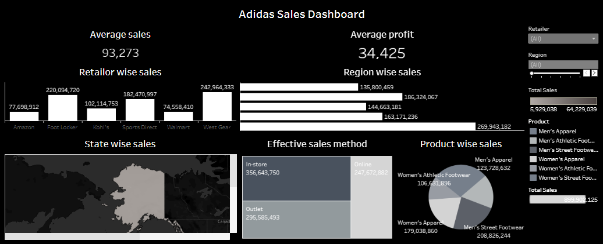

Adidas Sales Analytics Dashboard

📌 Project Overview
This project showcases an interactive Tableau dashboard developed to analyze Adidas sales performance across different retailers, regions, product categories, and sales methods. The dashboard provides a high-level overview of sales performance and enables users to explore trends through interactive visualizations.

🎯 Business Objective
The objective of this project is to analyze sales performance using interactive visualizations that enable users to compare trends across different business dimensions and better understand overall business performance.

🛠 Technologies Used
- Tableau Public
- Microsoft Excel
- Data Visualization
- Interactive Dashboard Design

📊 Dashboard Features
The dashboard includes interactive visualizations for:
- Total Sales Performance
- Regional Sales Analysis
- Retailer-wise Performance
- Product Category Analysis
- Sales Method Comparison
- Interactive Filters for data exploration

📈 Dashboard Highlights
The dashboard allows users to:
- Compare sales performance across different regions.
- Identify top-performing retailers.
- Analyze sales by product category.
- Monitor overall business performance through key metrics.
- Explore sales trends using interactive filters.

💼 Business Value
This dashboard demonstrates how interactive data visualization can transform raw sales data into meaningful business insights, making it easier to monitor sales performance across multiple business dimensions.

📂 Repository Contents
Dashboard/
    Adidas Sales Dashboard.twbx

Images/
    adidas-sales-dashboard.png

README.md

🚀 Future Improvements
Possible future enhancements include:
- Customer segmentation
- Profitability analysis
- Sales trend forecasting
- KPI tracking dashboard

🌱 Learning Outcome
This project was created as part of my learning journey in data analytics. It helped me strengthen my understanding of dashboard design, data visualization principles, and transforming business data into interactive reports using Tableau.

As I continue my journey in data analytics, I aim to build more end-to-end projects using SQL, Excel, Power BI, and Python to further strengthen my analytical and problem-solving skills.

📷 Dashboard Preview

